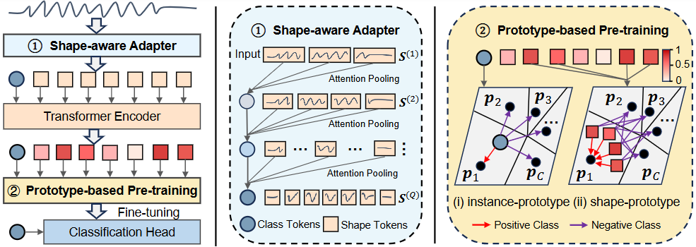

# A Unified Shape-Aware Foundation Model for Time Series Classification

This is the training code for our paper "A Unified Shape-Aware Foundation Model for Time Series Classification" (AAAI-26).

---

## 🧭 Overview

Foundation models pre-trained on large-scale source datasets are reshaping the traditional training paradigm for time series classification.
However, existing time series foundation models primarily focus on forecasting tasks and often overlook classification-specific challenges, such as modeling interpretable shapelets that capture class-discriminative temporal features. 
To bridge this gap,  we propose UniShape, a unified shape-aware foundation model designed for time series classification. 
UniShape incorporates a shape-aware adapter that adaptively aggregates multiscale discriminative subsequences (shapes) into class tokens,  effectively selecting the most relevant subsequence scales to enhance model interpretability. Meanwhile, a prototype-based pretraining module is introduced to jointly learn instance- and shape-level representations, enabling the capture of transferable shape patterns. 
Pre-trained on a large-scale multi-domain time series dataset comprising 1.89 million samples, UniShape exhibits superior generalization across diverse target domains.
Experiments on 128 UCR datasets and 30 additional time series datasets demonstrate that UniShape achieves state-of-the-art classification performance, with interpretability and ablation analyses further validating its effectiveness. 

<p align="center">
  
</p>

---

## 📂 Datasets

### 🔹 Pretraining Source Dataset

The large-scale pretraining dataset is constructed from the **UCR archive**, **UEA archive**, and **eight domain-diverse datasets (TFC-8)**.

**Download Links:**
- **UCR Archive (128 datasets):** [https://www.cs.ucr.edu/~eamonn/time_series_data_2018/](https://www.cs.ucr.edu/~eamonn/time_series_data_2018/)
- **UEA Archive (30 datasets):** [http://www.timeseriesclassification.com/dataset.php](http://www.timeseriesclassification.com/dataset.php)
- **TFC-8:** [Google Drive](https://drive.google.com/file/d/1J2AiL2KgDpZGprnWfH-cqza-Dih25p5z/view?usp=sharing)

You can generate the merged **1.89M-sample pretraining dataset** using  
[`data_pre/pretrain_dataset_pre.py`](data_pre/pretrain_dataset_pre.py), or download it directly:

- **Pretraining Dataset (1.89M samples):** [Google Drive](https://drive.google.com/drive/folders/1tZEMhhRsxv81_40hOpArvIW_CqcFHRyC?usp=sharing)

---

### 🔹 Target Datasets

For evaluation, UniShape is tested on **128 UCR datasets** and **30 additional TSC datasets**, following *“Bake Off Redux: A Review and Experimental Evaluation of Recent Time Series Classification Algorithms.”*

**Download Links:**
- **UCR Archive (128 datasets):** [https://www.cs.ucr.edu/~eamonn/time_series_data_2018/](https://www.cs.ucr.edu/~eamonn/time_series_data_2018/)
- **30 Additional Datasets:** [Google Drive](https://drive.google.com/file/d/1vuh6mgNrNKjHr9MMRQP0J0_gGA4dE7E3/view?usp=sharing)

Please refer to **page 13** of the [PDF](https://www.cs.ucr.edu/~eamonn/time_series_data_2018/BriefingDocument2018.pdf) document for the password to access the zipped file of the UCR archive.


---

## 🚀 Getting Started

### 🔧 Pretraining

To pre-train UniShape on the large-scale dataset:

```bash
python unishape_pretrain.py --label_ratio 0.10 --your_args_here
````

See [`unishape_pretrain.py`](unishape_pretrain.py) for all available arguments and detailed usage.

---

### 🎯 Fine-tuning

To fine-tune a pre-trained UniShape model for downstream classification:

```bash
python unishape_finetune.py --dataset CBF --your_args_here
```

Refer to [`unishape_finetune.py`](unishape_finetune.py) for fine-tuning options and configuration examples.

---

### 🧩 Zero-shot Evaluation

To perform zero-shot classification using a pre-trained UniShape model:

```bash
python unishape_zeroshot.py --dataset CBF --your_args_here
```

For full options, see [`unishape_zeroshot.py`](unishape_zeroshot.py).

---

## 🙏 Acknowledgements

This codebase is inspired by the following repositories:

* **NuTime:** [https://github.com/chenguolin/NuTime](https://github.com/chenguolin/NuTime)
* **Mantis:** [https://github.com/vfeofanov/mantis](https://github.com/vfeofanov/mantis)

---

## 📖 Citation

If you find this work useful, please cite our paper:

```bibtex
@inproceedings{liu2026unishape,
  title={A Unified Shape-Aware Foundation Model for Time Series Classification},
  author={Liu, Zhen and Wang, Yucheng and Li, Boyuan and Zheng, Junhao and Eldele, Emadeldeen and Wu, Min and Ma, Qianli},
  booktitle={Proceedings of the AAAI Conference on Artificial Intelligence},
  year={2026}
}
```
